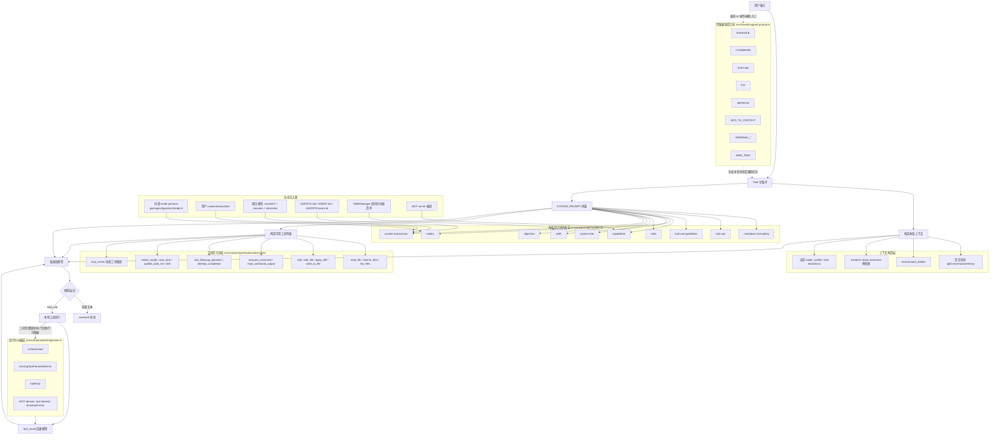
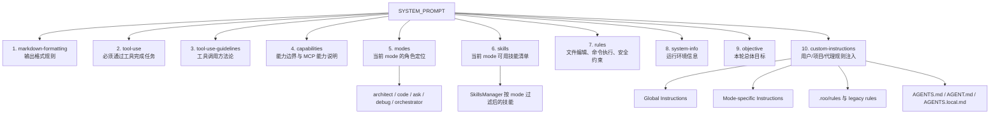
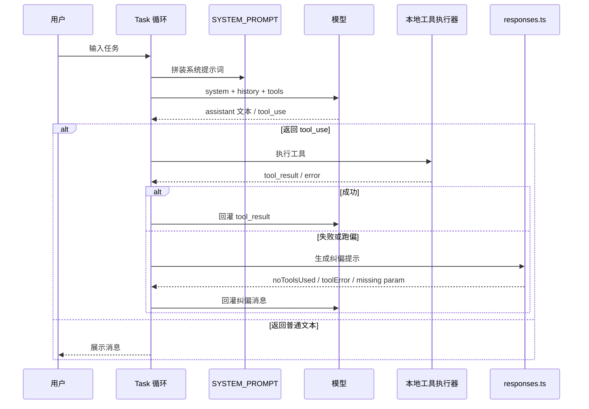

# RooCode 提示词体系图

这份图基于 [`roo-prompts-annotated.zh-CN.md`](d:/lidongyaosproject/RooCodeDemo/Roo-Code/docs/roo-prompts-annotated.zh-CN.md) 整理，目标不是逐字摘录，而是把 RooCode 的提示词系统按“来源 -> 拼装 -> 运行 -> 纠偏”画成一张能快速建立心智模型的结构图。

建议在 VS Code Markdown Preview 中查看，`Mermaid` 图会更清晰。

## 1. 总体体系图

## 2. 系统主提示词堆栈图

这个图只看 `SYSTEM_PROMPT` 本体，强调“谁在定义 RooCode 的人格、边界和工作方式”。

## 3. 运行时行为图

这个图强调：RooCode 不是“提示词一次成型”，而是“提示词 + 工具 + 错误纠偏”的循环系统。

## 4. 你可以怎么理解这套体系

- `modes.ts` 决定“我是谁”。它给 RooCode 当前模式的人格、职责和适用场景。
- `rules.ts` 和 `tool-use*.ts` 决定“我怎么做事”。它们约束必须优先读文件、调用工具、谨慎编辑、避免跳步。
- `objective.ts` 决定“我当前要完成什么”。它更像任务导向的总目标段。
- `custom-instructions.ts` 决定“项目现场怎么改写默认行为”。它把用户偏好、仓库规则、`AGENTS.md`、`.roo/rules` 全部叠加进去。
- `native-tools/*` 决定“模型知道自己有哪些手和脚”。这些不是普通说明文，而是工具 schema 的自然语言接口描述。
- `responses.ts` 决定“做错了以后怎么拉回来”。这部分很关键，它让 RooCode 形成带纠偏能力的闭环。
- `support-prompt.ts` 不直接属于主任务循环的 system prompt，但它服务于增强输入、压缩上下文、解释终端、创建新任务等旁路能力。

## 5. 对应源码位置

- 系统主拼装入口：
  [`src/core/prompts/system.ts`](d:/lidongyaosproject/RooCodeDemo/Roo-Code/src/core/prompts/system.ts)
- 主提示词分段：
  [`src/core/prompts/sections/`](d:/lidongyaosproject/RooCodeDemo/Roo-Code/src/core/prompts/sections)
- 内置模式：
  [`packages/types/src/mode.ts`](d:/lidongyaosproject/RooCodeDemo/Roo-Code/packages/types/src/mode.ts)
- 运行时纠偏：
  [`src/core/prompts/responses.ts`](d:/lidongyaosproject/RooCodeDemo/Roo-Code/src/core/prompts/responses.ts)
- 辅助提示词：
  [`src/shared/support-prompt.ts`](d:/lidongyaosproject/RooCodeDemo/Roo-Code/src/shared/support-prompt.ts)
- 工具描述：
  [`src/core/prompts/tools/native-tools/`](d:/lidongyaosproject/RooCodeDemo/Roo-Code/src/core/prompts/tools/native-tools)

## 6. 一句话总结

RooCode 的提示词体系不是单个 system prompt，而是一个由“主提示词堆栈 + mode persona + 项目规则注入 + 工具描述 + 运行时纠偏提示”组成的分层控制系统。
